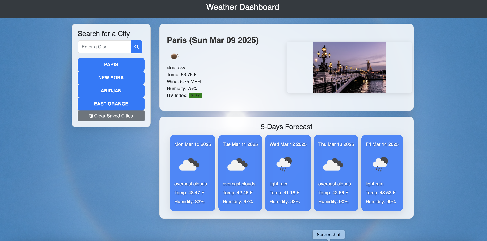

# Homework 06 Server-Side APIs: Weather Dashboard

[KevKouadio Weather Dashboard GitHub IO'](https://kevkouadio.github.io/KK-Weather-Dashboard/)

# Summary

This weather dashboard app runs in the browser and feature dynamically updated HTML and CSS. 
The app uses [OpenWeather API](https://openweathermap.org/api) API to retrieve weather data for cities and JQuery to make dynamic changes to the HMTL document.
It uses `localStorage` to store any persistent data.

## Features:

GIVEN a weather dashboard with form inputs
WHEN the user search for a city,
The searched city is presented with current and future conditions for that city and that city is added to the search history
The user can view current weather conditions for that city with the city name, the date, an icon representation of weather conditions, the temperature, the humidity, the wind speed, and the UV index colored according to the index level (Green="Low", Yello="Moderate", Orange="High", Red="Very high" and Violet="Extreme").
The user can also view a 5-day forecast that displays the date, an icon representation of weather conditions, the temperature, and the humidity for that city,
The cities history is clickable and display the current weather and the 5-days forecast.

The following image demonstrates the application functionality:

